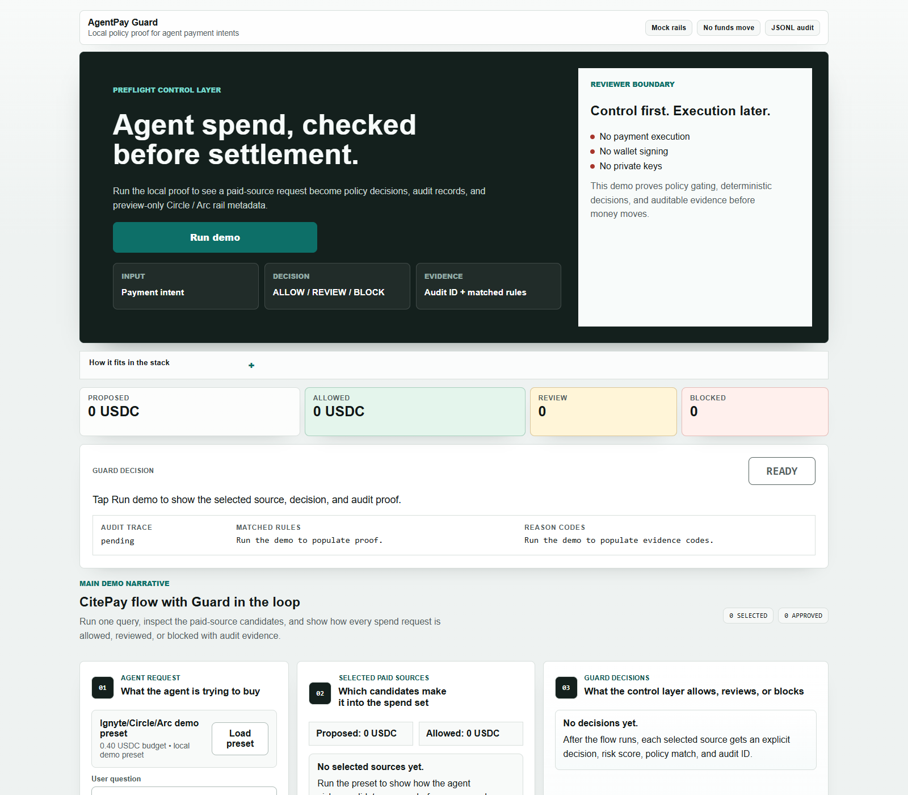

# AgentPay Guard

> Deterministic policy and evidence for proposed AI-agent USDC payment intents, before any future settlement adapter.

[](https://github.com/KirillNedoboy/agentpay-guard-circle-arc/actions/workflows/ci.yml) [](./LICENSE)



AgentPay Guard gives builders and reviewers a deterministic decision before an AI agent can reach a future USDC payment adapter. It evaluates a proposed intent, returns `ALLOW`, `REVIEW`, or `BLOCK`, and records append-only JSONL evidence plus an AgentPay Receipt. The demo is a local policy proof; it does not settle a payment.

## Judge links

- [Live demo](https://138-124-108-146.nip.io) — deployed baseline; this PR's x402-first screen requires deployment before it is reflected there.
- [Demo video on YouTube](https://youtu.be/Zj_sK3MY9kQ) — earlier CitePay-led walkthrough, preserved for reference.
- [Fallback MP4](./docs/videos/agentpay-guard-demo-en.mp4) — the same earlier walkthrough.
- [Submission deck (PDF)](./docs/agentpay-guard-deck.pdf)
- [Reviewer one-pager](./docs/reviewer-one-pager.md)
- [Architecture](./docs/architecture.md)
- [Screenshot evidence](./docs/screenshots.md)

## What it does

- Evaluates amount, recipient, scenario, budget, suspicious terms, and velocity with deterministic rules.
- Returns `ALLOW`, `REVIEW`, or `BLOCK`, with matched rules and reason codes.
- Preserves audit evidence by `idempotencyKey` and builds an AgentPay Receipt with `fundsMoved: false`.
- Shows x402-style API access first, with CCTP, ERC-20 authority, Paymaster, and Arc Testnet as proposal-only policy contexts.

## Why this matters

Agents can request paid data or API access quickly. A future payment adapter still needs a clear answer to a simpler question first: is this proposed spend within policy, explainable, and recorded? AgentPay Guard supplies that preflight decision without pretending to be the rail itself.

## Reviewer path

1. Open the demo and click **Run x402 policy proof**.
2. Inspect the trusted `0.08 USDC` API intent, policy envelope, matched rules, reason codes, and `ALLOW` decision.
3. Open the AgentPay Receipt and confirm the audit evidence, `fundsMoved: false`, and the non-broadcast future-adapter preview.
4. Use the visible `ALLOW`, `REVIEW`, and `BLOCK` cases for the other deterministic outcomes.

## Safety boundary

This repository does not move funds, connect wallets, sign transactions, store private keys, create permits or UserOperations, read balances or allowances, call Circle, Arc, CCTP, Gateway, x402, Iris, bundlers, or EntryPoints, or create transaction hashes. An `ALLOW` only means that a separately authorised future adapter could be considered.

## Run locally

```bash
pnpm install --frozen-lockfile
pnpm test
pnpm lint
pnpm typecheck
pnpm build
pnpm dev
```

Open `http://localhost:3000`. `pnpm smoke` is optional and requires a running server; set `AGENTPAY_AUDIT_LOG_PATH` to a temporary file when you want an isolated smoke run.

## Repository map

```txt
src/domain/payment-intent  intent types, validation, receipts, and judge preset
src/domain/policy          deterministic engine and spend controls
src/domain/audit           append-only JSONL evidence and idempotency
src/app                    Next.js demo and local API routes
docs/                      reviewer, submission, architecture, and evidence materials
examples/                  deterministic demo fixtures
tests/                     policy, audit, API, and receipt coverage
```

## Implemented scenarios

| Scenario | Expected decision | Evidence shown |
| --- | --- | --- |
| Trusted x402-style API access, `0.08 USDC` | `ALLOW` | Spend controls, rules, audit ID, and receipt |
| Premium or unknown payment context | `REVIEW` | Reason codes and review-required evidence |
| Denylisted or unsupported payment context | `BLOCK` | Deterministic block reasons |
| CCTP, ERC-20 authority, and Paymaster contexts | Varies by fixture | Proposal-only policy evidence; no protocol call |
